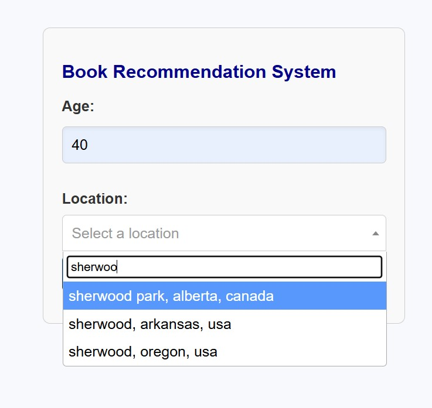
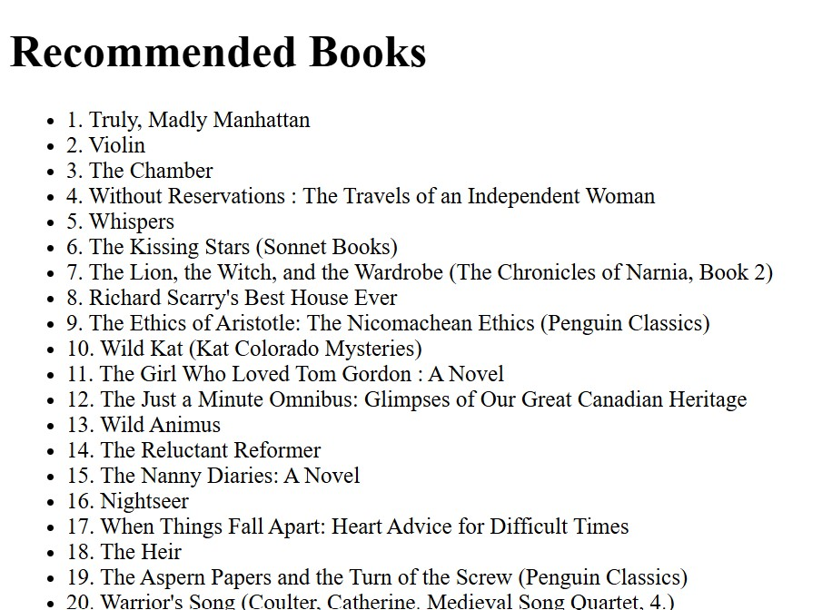

## Customer Segmentation for Online Bookstore
# Project Overview 🌟
This project focuses on segmenting customers of an online bookstore using machine learning algorithms. By categorizing customers based on their purchase behaviors, this system helps identify target customer groups, enabling personalized marketing strategies and improving the overall user experience.

# Dataset 📊
[Online data for books from Amazon along with user ratings and users who bought them](https://www.kaggle.com/datasets/saurabhbagchi/books-dataset)

# Features 🔍
- Customer segmentation using clustering algorithms (K-Means, DBSCAN).
- Data preprocessing and exploratory analysis to derive meaningful insights.
- Interactive dashboards to visualize customer clusters and behavioral patterns.
- Web-based interface for showcasing customer profiles and segment-specific analytics.

# TechStack ⚙️
- Programming Language: Python
- Frameworks and Libraries: Flask, scikit-learn, Pandas, Matplotlib, Seaborn, Plotly
- Visualization Tools: Plotly Dash
- Deployment Environment: Localhost

# Web Page for Recommending books 📸
<div style="display: flex; justify-content: space-around;">
    
    
</div>

# Segmentation Dashboards on the basis of Users and Book Authors according to Ratings 📸
<div style="display: flex; justify-content: space-around;">
    
    
</div>

# Data Pipeline 🧑‍💻
### Data Preprocessing:
    - Data cleaning, handling missing values, and normalization.
    - Feature selection to extract the most relevant variables for clustering.
### Clustering and Analysis:
    - Applied K-Means clustering and DBSCAN algorithms to identify customer groups.
    - Evaluated clustering performance using silhouette scores and Davies-Bouldin index.
### Visualization:
    - Created visualizations of clusters and demographic insights using Plotly and Tableau.
### Web-Based Presentation:
    - Built an interactive Flask web app to display customer segments on the basis of Age and Location and returns list of preferred books for the user.
    
# Getting Started 🚀
- Prerequisites
    - Python 3.12+
    - Required Python libraries: Flask, Pandas, scikit-learn, Matplotlib, Plotly.
  
# Installation 
1. Clone this repository:
   ```bash
   git clone https://github.com/Kerissa23/BookShelf-and-Users-Analytics-based-Segmentation.git
   cd BookShelf-and-Users-Analytics-based-Segmentation
2. Install dependencies:
    ```bash
    pip install -r requirements.txt  
3. Run in the Flask Application for Segmentation of Customers on the basis of Age and Location which returns recommended books.
   ```bash
   python app.py  
4. Run the Users Segmentation Dashboard for visualising the customer segmentation on the basis of various categories.
   ```bash
   python users_dashboard.py
5. Run the Book Authors Segmentation to know about which books are doing good in the market and which are not showing any significant improvement for earning revenue.
   ```bash
   python book_dashboard.py

# Usage
- Explore customer clusters and purchase behavior through the dashboard.
- Use the insights to optimize marketing strategies and improve customer retention.
- 
# Future Enhancements
- Integration of a recommendation system for personalized product suggestions.
- Implementation of real-time analytics for live customer behavior tracking.
- Deployment on a cloud platform for scalability.
