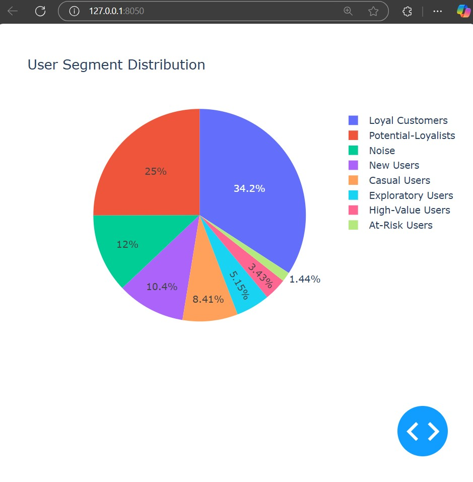
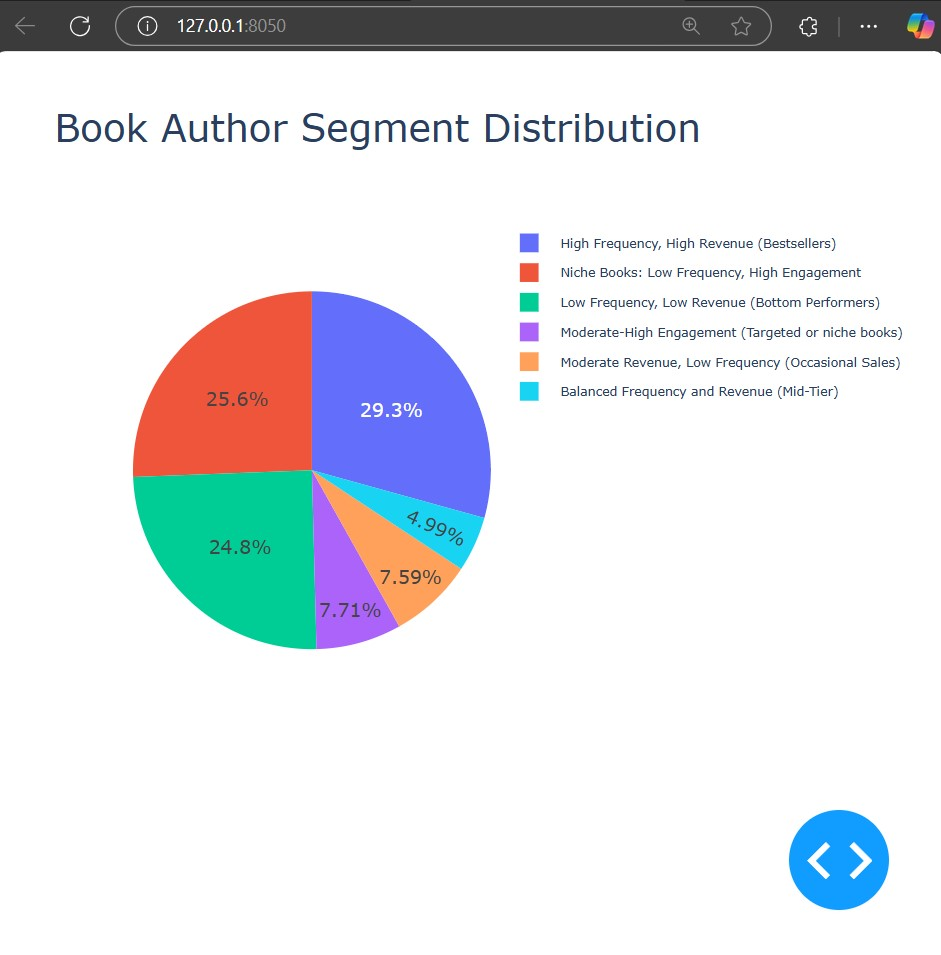

## Customer Segmentation for Online Bookstore
# Project Overview 🌟
This project focuses on segmenting customers of an online bookstore using machine learning algorithms. By categorizing customers based on their purchase behaviors, this system helps identify target customer groups, enabling personalized marketing strategies and improving the overall user experience.

# Features 🔍
- Customer segmentation using clustering algorithms (K-Means, DBSCAN).
- Data preprocessing and exploratory analysis to derive meaningful insights.
- Interactive dashboards to visualize customer clusters and behavioral patterns.
- Web-based interface for showcasing customer profiles and segment-specific analytics.

# TechStack ⚙️
- Programming Language: Python
- Frameworks and Libraries: Flask, scikit-learn, Pandas, Matplotlib, Seaborn, Plotly
- Visualization Tools: Plotly Dash
- Deployment Environment: Localhost

# Users Segmentation Dashboard 📸

# Book Authors Segmentation Dashboard 📸

# Data Pipeline
- Data Preprocessing:
    - Data cleaning, handling missing values, and normalization.
    - Feature selection to extract the most relevant variables for clustering.
- Clustering and Analysis:
    - Applied K-Means clustering and DBSCAN algorithms to identify customer groups.
    - Evaluated clustering performance using silhouette scores and Davies-Bouldin index.
- Visualization:
    - Created visualizations of clusters and demographic insights using Plotly and Tableau.
- Web-Based Presentation:
    - Built an interactive Flask web app to display customer segments on the basis of Age and Location and returns list of preferred books for the user.
# Getting Started
- Prerequisites
    - Python 3.12+
    - Required Python libraries: Flask, Pandas, scikit-learn, Matplotlib, Plotly.
# Installation 

# Usage
- Explore customer clusters and purchase behavior through the dashboard.
- Use the insights to optimize marketing strategies and improve customer retention.
# Future Enhancements
- Integration of a recommendation system for personalized product suggestions.
- Implementation of real-time analytics for live customer behavior tracking.
- Deployment on a cloud platform for scalability.
